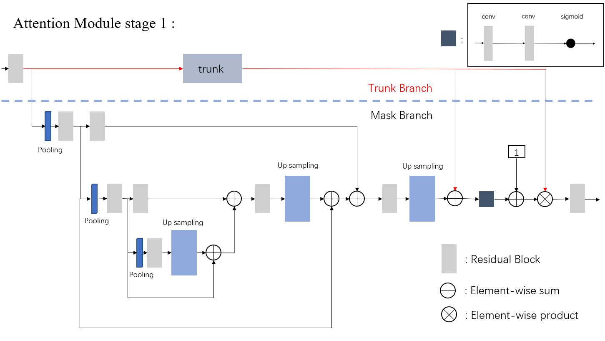
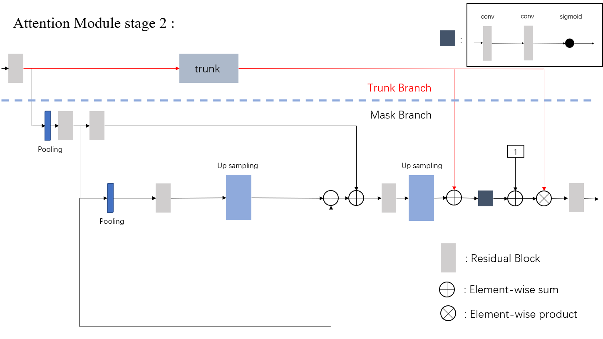
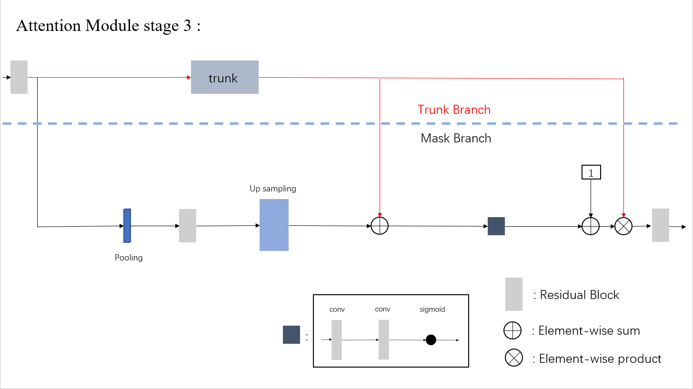

# Using-Chest-X-Rays-to-Detect-Pneumonia-with-Residual-Attention-Network
#### Implement Attention_56, Attention_92 with pytorch and use this model in the task of pneumonia detection.
#### Dataset: 
>NIH Chest X-Ray-14 dataset 
(https://www.nih.gov/news-events/news-releases/nih-clinical-center-provides-one-largest-publicly-available-chest-x-ray-datasets-scientific-community)
#### Referance: 
>[1]CheXNet: Radiologist-Level Pneumonia Detection on Chest X-Rays with Deep Learning  
[2]Residual Attention Network for Image Classification
#### Description:
>[1]basic_layers:Implement residual block  
[2]attention_module: Implement Attention_56 and Attention_92 (consist of residual blocks and attention blocks)  
[3]residual_attention_network: Implement attention block  
#### Structure:
>  
>  
>  
